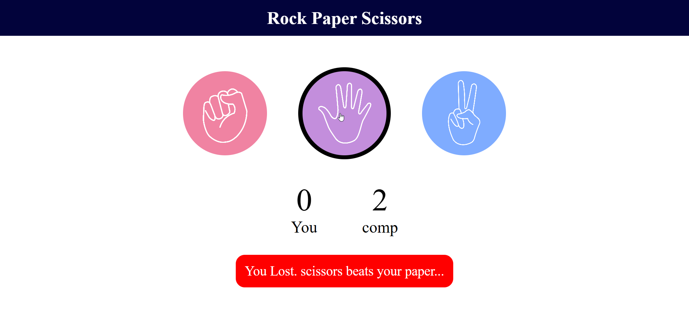

# ✊✋✌ Rock Paper Scissors Game

A simple and interactive **Rock Paper Scissors Game** built using **HTML, CSS, and JavaScript**. This project allows users to play against the computer with real-time score tracking and instant result display.

## 🚀 Features

* Play Rock, Paper, or Scissors against the computer
* Random computer choice generation
* Real-time score tracking
* Interactive and user-friendly interface
* Instant result display (Win, Lose, or Draw)
* Responsive design

## 🛠️ Technologies Used

* HTML5
* CSS3
* JavaScript (ES6)

## 📂 Project Structure

```bash
Rock_Paper_Scissors__Game/
│
├── index.html
├── style.css
├── app.js
└── images/
    └── paper.png
    └── rock.png
    └── scissors.png
└── screenshots/
    └── game_pic.png
└── README.md

```

## 🎮 How to Play

1. Open the game in your browser.
2. Choose one of the options:

   * ✊ Rock
   * ✋ Paper
   * ✌ Scissors
3. The computer will randomly select its choice.
4. The winner will be determined based on the game rules:

   * Rock beats Scissors
   * Scissors beats Paper
   * Paper beats Rock
5. Scores will be updated automatically.

## 📸 Screenshot

Add a screenshot of your project here.

```markdown

```

## 🔧 Installation

1. Clone the repository:

```bash
git clone https://github.com/Pinkykumari9546/Rock_Paper_Scissors__Game.git
```

2. Open `index.html` in your browser.

## 🤝 Contributing

Contributions are welcome! Feel free to fork this repository and submit a pull request.

## ⭐ Support

If you like this project, don't forget to give it a **star** on GitHub.

## 📄 License

This project is open-source and available under the MIT License.
